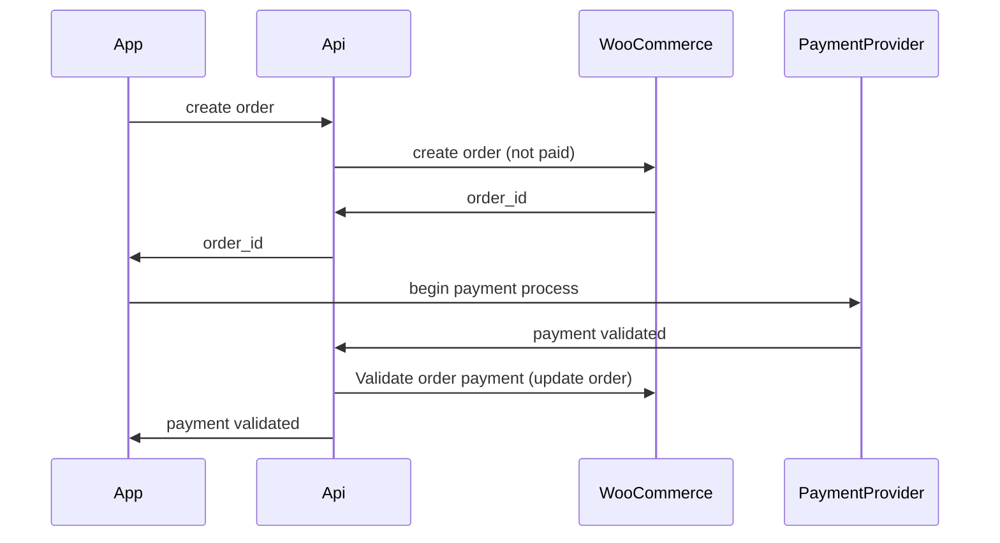
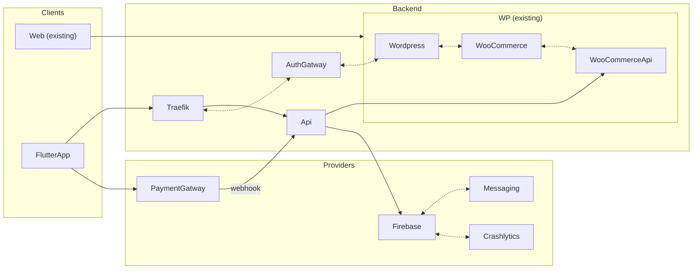

# Ybera Paris

## Fonctionnalités

### Authentification

Les utilisateurs et clients sont uniquement des professionels. Ils peuvent s'inscrire depuis l'application mais leurs status de professionel doit être validé manuellement par un administrateur.

- Login : Géré par wordpress
- Register : Géré par wordpress
- Supprimer son compte (obligatoire pour l'app store) : Envoi d'un mail automatique à un administrateur

L'authentification de Woo Commerce repose sur celle de wordpress. Il éxiste des plugins permettant de simplifier cette API : [https://wordpress.org/plugins/jwt-authentication-for-wp-rest-api/](https://wordpress.org/plugins/jwt-authentication-for-wp-rest-api/)

> Cette API de wordpress sera appellé par l'API custom afin de pemettre une meilleure gestion et validation des données envoyés

### Catalogue et commandes

L'API de Woo Commerce fournis une liste complète de endpoint nécessaire :
- Récupérer les catagories : [https://woocommerce.github.io/woocommerce-rest-api-docs/#list-all-product-categories](https://woocommerce.github.io/woocommerce-rest-api-docs/#list-all-product-categories)
- Récupèrer les produits : [https://woocommerce.github.io/woocommerce-rest-api-docs/#list-all-products](https://woocommerce.github.io/woocommerce-rest-api-docs/#list-all-products)
- Récupèrer un produit particulier : [https://woocommerce.github.io/woocommerce-rest-api-docs/#retrieve-a-product](https://woocommerce.github.io/woocommerce-rest-api-docs/#retrieve-a-product)
- Créer une commande : [https://woocommerce.github.io/woocommerce-rest-api-docs/#create-an-order](https://woocommerce.github.io/woocommerce-rest-api-docs/#create-an-order)
- Récupèrer une commande : [https://woocommerce.github.io/woocommerce-rest-api-docs/#retrieve-an-order](https://woocommerce.github.io/woocommerce-rest-api-docs/#retrieve-an-order)
- Lister les commandes : [https://woocommerce.github.io/woocommerce-rest-api-docs/#list-all-orders](https://woocommerce.github.io/woocommerce-rest-api-docs/#list-all-orders)

### Coupons de réduction

L'API de WooCommerce permet une gestion des coupons de réduction : [https://woocommerce.github.io/woocommerce-rest-api-docs/#coupons](https://woocommerce.github.io/woocommerce-rest-api-docs/#coupons)

### Fidelités

L'API de WooCommerce ne permet pas de gérer des points de fidélité ou autre. Il existe un plugin [https://woocommerce.com/fr-fr/products/woocommerce-points-and-rewards/](https://woocommerce.com/fr-fr/products/woocommerce-points-and-rewards/) mais celui ci ne contient pas d'API REST.

Il est cependant possible, via notre API custom, de calculer les points en temps réel et de générer des coupons de réduction personnalisé lorsque l'utilisateur voudra utiliser ses points (cf. Coupons de réduction).

### Parainage

WooCommerce fournis un plugin pour la gestion des parainages [https://woocommerce.com/document/referral-system-for-woocommerce/#section-18](https://woocommerce.com/document/referral-system-for-woocommerce/#section-18). Cependant il a l'air très compliqué à configurer et l'API est très limité.

Cependant, de même que pour le système de fidélité, notre API custom nous permet de gérer cela à part. Ca permettra également une plus grande liberté sur ce que ce système de parainage autorisera par la suite.

Le problème de cette méthode séparé est que ce ne sera pas intégrable à la version web de WooCommerce : A définir

### Actualité

Si les actualités sont fournis par wordpress, celui ci fournis une API permettant de les récupèrer afin de les afficher dans l'application [https://developer.wordpress.org/rest-api/reference/posts/](https://developer.wordpress.org/rest-api/reference/posts/).

### Paiement

La partie paiement ne peut être gérée par WooCommerce. Leurs API étant destiné qu'a un usage administrateur, elle ne gère donc pas les paiements. Cette partie sera donc géré séparement et de manière asynchrone.

Le système de paiement devra faire appel à des fournisseurs exterieur (Banque, Paypal, Stripe ou autre) afin de leurs déleguer la gestion des données sensible (informations banquaire etc...).

Il faudra tout de même définir la liste des prestataire et des méthodes à intégrer.

### Notifications push

Toutes les notifications push seront intégré vie Firebase. Ce service permet de simplifier la gestion des notifications et permet également une intégration par plusieurs autres services (wordpress, ou autre).

## Proposition d'architecture

### Backend

- `Traefik` est un proxy permettant de traiter toutes les requêtes entrante vers l'API. Il permet par exemple de les authentifier lorsque c'est nécessaire avant de les rediriger vers le service voulu
- Le `PaymentGatway` est un service fournis par la plupart des banques afin de leurs délèguer la partie paiement. Elle s'intègre côté app comme une page web et renvoi la validation de paiement à l'api de façon asynchrone. De cette manière, l'API n'es jamais chargé de traiter des informations sensible (carte banquaire ou autre). Le `PaymentGatway` peut également être un service tiers tel que Paypal ou stripe.
- `AuthGatway` est un service permettant d'authentifier toutes les requêtes via wordpress. De cette manière on s'assure que toutes les requêtes nécessitant une authentification (toutes sauf connexion et inscription) proviennent bien d'un utilisateur inscrit.
- `WooCommerceApi` est l'api fournis par Woo Commerce. Celle-ci ne peut-être utilisé qu'en tant qu'administrateur. Il est donc nécessaire d'ajouter une interface (`Api`) entre celle-ci et l'application Flutter
- `Firebase` est un service de Google permettant de simplifier plusieurs fonctionnalités basique d'une application. Il est en très grosse partie utilisé pour gérer uniquement les notifications push gratuitement.

### Application

Toutes les applications que je développent contienent les mêmes bases :
- Technologie : Flutter  - permet de développer les applications ios et android à partir de la même base de code
- Internationnalisation : Toutes mes applications sont conçues pour pouvoir être traduite rapidement dans plusieurs langues plus tard si nécessaire. 
- Automatisation : 
  - Le déploiement des différentes version de l'application est géré automatiquement par le service CodeMagic. Cela permet de s'assurer que les versions seront toutes testé et déployées sur le même environnement
  - Les captures d'écrans nécessaires pour les stores sont également automatiser afin de s'assurer qu'elles seront toujours conforment à la version déployée sans avoir à tout refaire à chaque mise à jour
  
Design : [https://xd.adobe.com/view/81d0226b-51f2-40cd-b61b-d3029a754cdc-d483/?hints=off](https://xd.adobe.com/view/81d0226b-51f2-40cd-b61b-d3029a754cdc-d483/?hints=off)